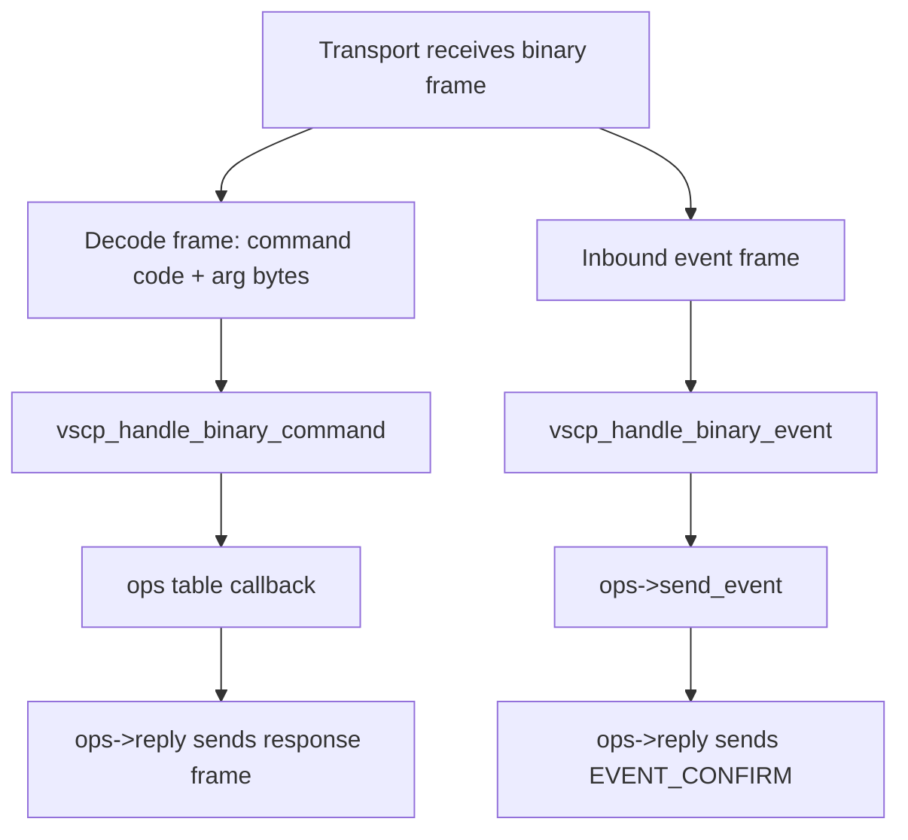

# vscp-binary

Last updated: 2026-06-11

This module implements the VSCP Binary Protocol command dispatcher for firmware targets. It decodes binary command frames, delegates all application work through an operations table, and sends binary reply frames back through the same table.

- Header: `common/vscp-binary.h`
- Implementation: `common/vscp-binary.c`

---

## Scope and model

`vscp-binary` does not own sockets, transports, user databases, event queues, or persistent state. It is a protocol layer that:

1. Accepts a decoded command code and argument bytes.
2. Dispatches to the appropriate ops-table callback.
3. Sends a reply through `ops->reply`.

Core entry points:

- `vscp_handle_binary_command(vscp_binary_ctx_t *pctx, uint16_t command, const uint8_t *parg, size_t len)`
- `vscp_handle_binary_event(vscp_binary_ctx_t *pctx, vscp_event_t *pEvent)`

---

## Typical integration flow



---

## Context and ops table setup

Allocate one `vscp_binary_ctx_t` per connection. Populate a `vscp_binary_ops_t` struct with your callbacks and assign it before the first call:

```c
static const vscp_binary_ops_t my_ops = {
  .reply         = my_reply,
  .quit          = my_quit,
  .user          = my_user,
  .password      = my_password,
  // ... all other callbacks
};

vscp_binary_ctx_t ctx = { .ops = &my_ops };

// Command received from transport:
vscp_handle_binary_command(&ctx, command_code, arg_bytes, arg_len);

// Event received from transport:
vscp_handle_binary_event(&ctx, pev);
```

---

## Operations table (`vscp_binary_ops_t`)

Every callback receives `vscp_binary_ctx_t *pctx` as its first argument.

**Mandatory** — `vscp_handle_binary_command` returns `VSCP_ERROR_INIT_MISSING` if this is NULL:

| Field | Signature | Purpose |
|---|---|---|
| `reply` | `(pctx, command, error, parg, len)` | Send a response frame to the client |

**Optional** — set to NULL if not needed:

| Group | Fields |
|---|---|
| Session | `quit`, `user`, `password`, `challenge`, `check_authenticated` |
| Event I/O | `send_event`, `get_event`, `get_eventex`, `send_asyncevent` |
| Channel | `open`, `close`, `is_open` |
| Queue | `check_data`, `clrall` |
| Metadata | `get_chid`, `set_guid`, `get_guid`, `get_version`, `statistics`, `info` |
| Filter | `setfilter`, `setmask` |
| Interface | `get_interface_count`, `get_interface`, `interface_open`, `interface_close` |
| Control | `test`, `wcyd`, `shutdown`, `restart` |
| Mode | `text` |
| Extension | `user_command` |

---

## Command codes and dispatch

| Code | Constant | Description |
|---|---|---|
| `0x0000` | `VSCP_BINARY_COMMAND_CODE_NOOP` | No-operation; reply with success |
| `0x0001` | `VSCP_BINARY_COMMAND_CODE_QUIT` | Close connection via `ops->quit` |
| `0x0002` | `VSCP_BINARY_COMMAND_CODE_USER` | Pass username string to `ops->user` |
| `0x0003` | `VSCP_BINARY_COMMAND_CODE_PASS` | Pass password string to `ops->password` |
| `0x0004` | `VSCP_BINARY_COMMAND_CODE_CHALLENGE` | Generate 16-byte challenge via `ops->challenge` |
| `0x0005` | `VSCP_BINARY_COMMAND_CODE_SEND` | Parse event frame, call `ops->send_event` |
| `0x0006` | `VSCP_BINARY_COMMAND_CODE_RETR` | Retrieve events via `ops->get_event`; returns `VSCP_ERROR_UNSUPPORTED` when channel is open |
| `0x0007` | `VSCP_BINARY_COMMAND_CODE_OPEN` | Open async event channel via `ops->open` |
| `0x0008` | `VSCP_BINARY_COMMAND_CODE_CLOSE` | Close async event channel via `ops->close` |
| `0x0009` | `VSCP_BINARY_COMMAND_CODE_CHKDATA` | Return 4-byte event count from `ops->check_data` |
| `0x000A` | `VSCP_BINARY_COMMAND_CODE_CLEAR` | Clear input queue via `ops->clrall` |
| `0x000B` | `VSCP_BINARY_COMMAND_CODE_STAT` | Return 28-byte statistics from `ops->statistics` |
| `0x000C` | `VSCP_BINARY_COMMAND_CODE_INFO` | Return 12-byte status from `ops->info` |
| `0x000D` | `VSCP_BINARY_COMMAND_CODE_GETCHID` | Return 4-byte channel id from `ops->get_chid` |
| `0x000E` | `VSCP_BINARY_COMMAND_CODE_SETGUID` | Set GUID via `ops->set_guid` |
| `0x000F` | `VSCP_BINARY_COMMAND_CODE_GETGUID` | Return 16-byte GUID from `ops->get_guid` |
| `0x0010` | `VSCP_BINARY_COMMAND_CODE_VERSION` | Return 10-byte version from `ops->get_version` |
| `0x0011` | `VSCP_BINARY_COMMAND_CODE_SETFILTER` | Set filter (21 bytes); optionally set mask too (42 bytes) |
| `0x0012` | `VSCP_BINARY_COMMAND_CODE_SETMASK` | Set mask (21 bytes) via `ops->setmask` |
| `0x0013` | `VSCP_BINARY_COMMAND_CODE_INTERFACE` | Interface sub-commands: count (0), get (1), close (2), open (3) |
| `0x001E` | `VSCP_BINARY_COMMAND_CODE_TEST` | Run test via `ops->test` |
| `0x001F` | `VSCP_BINARY_COMMAND_CODE_WCYD` | Return 8-byte capability mask from `ops->wcyd` |
| `0x0020` | `VSCP_BINARY_COMMAND_CODE_SHUTDOWN` | Shut down via `ops->shutdown` |
| `0x0021` | `VSCP_BINARY_COMMAND_CODE_RESTART` | Restart via `ops->restart` |
| `0x0022` | `VSCP_BINARY_COMMAND_CODE_TEXT` | Switch to text mode via `ops->text` |
| `0xFF00`+ | `VSCP_BINARY_COMMAND_CODE_USER_START` | User-defined range; dispatched to `ops->user_command` |
| `0xFFFF` | `VSCP_BINARY_COMMAND_CODE_EVENT_CONFIRM` | Event confirmation (reply direction only) |

---

## SEND command argument format

The argument for `VSCP_BINARY_COMMAND_CODE_SEND` is a VSCP binary event frame (without the leading encoding byte). Internally parsed with `vscp_fwhlp_getEventFromFrame`.

## RETR command argument format

Two optional bytes: `parg[0..1]` = big-endian count of events to retrieve (default 1 if omitted). When the async channel is open (`ops->is_open` returns true), the command immediately returns `VSCP_ERROR_UNSUPPORTED` — events are delivered asynchronously instead.

## SETFILTER / SETMASK argument format

21 bytes: `[priority(1)] [class(2)] [type(2)] [GUID(16)]`.  
Sending 42 bytes to `SETFILTER` sets both filter (bytes 0–20) and mask (bytes 21–41) in one command.

## INTERFACE sub-command argument

| Byte 0 | Bytes 1–2 | Action |
|---|---|---|
| `0x00` | — | Get interface count (returns 2 bytes) |
| `0x01` | Big-endian index | Get interface info at index |
| `0x02` | Big-endian index | Close interface at index |
| `0x03` | Big-endian index | Open interface at index |

---

## vscp_handle_binary_event

Called when the transport receives an inbound event frame from the client.

```c
int vscp_handle_binary_event(vscp_binary_ctx_t *pctx, vscp_event_t *pEvent);
```

- Returns `VSCP_ERROR_INIT_MISSING` if `pctx` or `ops->reply` is NULL.
- Returns `VSCP_ERROR_PARAMETER` if `pEvent` is NULL.
- On success: calls `ops->send_event`, then sends an `EVENT_CONFIRM` reply with the event head and CRC.

---

## Minimal integration checklist

- [ ] `ops->reply` — always required
- [ ] `ops->quit` — for QUIT command
- [ ] `ops->user` + `ops->password` — for authentication
- [ ] `ops->send_event` — for SEND command
- [ ] `ops->get_event` — for RETR command (non-async path)
- [ ] `ops->is_open` — for RETR vs async-channel check
- [ ] `ops->check_data` — for CHKDATA command
- [ ] `ops->get_guid` + `ops->get_version` — for GETGUID / VERSION commands

---

## Related files

- `common/vscp-binary.h`
- `common/vscp-binary.c`
- `common/vscp-link-protocol.h` — text-mode counterpart
- `docs/vscp-link-protocol.md`
- `tests/vscp-binary-unittest.cpp`
