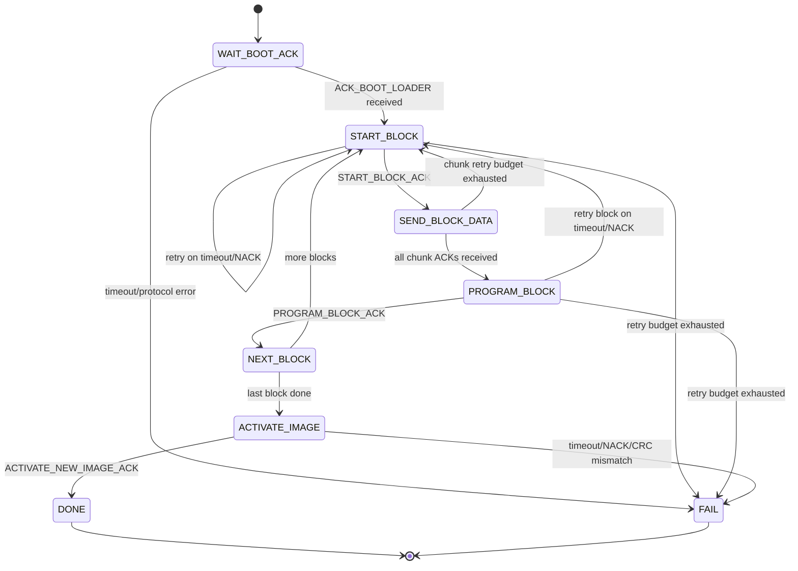

# vscp-bootloader-host-sequence

Last updated: 2026-02-19

This document describes the host-side firmware update sequence for nodes running the VSCP bootloader.

It complements the node-side module guide:

- `docs/vscp-bootloader.md`

---

## Scope

Use this sequence when implementing a host tool that uploads firmware blocks to a VSCP node in bootloader mode.

Goals:

- deterministically enter/update/activate firmware image
- handle ACK/NACK and timeout paths
- keep host and target block/CRC expectations aligned

---

## Preconditions

- The target is in bootloader mode (or can be switched into it).
- Host and target can exchange VSCP protocol events.
- Host knows image data and image length.
- Host can split image into target block size.

---

## Handshake and Capability Discovery

Wait for `VSCP_TYPE_PROTOCOL_ACK_BOOT_LOADER` from the node.

Extract from payload:

- `blockSize` (bytes 0..3, big-endian)
- `blockCount` (bytes 4..7, big-endian)

Validate:

- `blockSize > 0`
- image block count does not exceed `blockCount`

---

## Per-Block Transfer Sequence

For each block index `i`:

1. Send `VSCP_TYPE_PROTOCOL_START_BLOCK`
   - Data[0..3] = block index (big-endian)
   - Optional Data[4] = memory type
   - Optional Data[5] = memory bank
2. Wait for `VSCP_TYPE_PROTOCOL_START_BLOCK_ACK`
   - On `..._NACK`, retry block start or abort.
3. Send one or more `VSCP_TYPE_PROTOCOL_BLOCK_DATA` events
   - Fill exactly one target block (`blockSize`) from image.
   - Pad final short image block with `0xFF` bytes.
4. For each sent data event, wait for `VSCP_TYPE_PROTOCOL_BLOCK_DATA_ACK`
   - On `..._NACK` or timeout, resend current data event.
5. Send `VSCP_TYPE_PROTOCOL_PROGRAM_BLOCK_DATA`
   - Data[0..3] = same block index (big-endian)
6. Wait for `VSCP_TYPE_PROTOCOL_PROGRAM_BLOCK_DATA_ACK`
   - On `..._NACK`, restart this block from step 1.

---

## Activate New Image

After all blocks are programmed:

1. Calculate CRC-CCITT over the programmed image range using the same block/padding model as target.
2. Send `VSCP_TYPE_PROTOCOL_ACTIVATE_NEW_IMAGE`
   - Data[0..1] = expected CRC (big-endian)
3. Wait for `VSCP_TYPE_PROTOCOL_ACTIVATE_NEW_IMAGE_ACK`
   - On `..._NACK`, treat update as failed and diagnose CRC/image-range mismatch.

---

## Recommended Retry and Timeout Policy

Use bounded retries per stage.

Suggested defaults:

- Event response timeout: 500 ms to 2000 ms (transport-dependent)
- Retries per message: 3
- Retries per block: 2 (restart full block on repeated failure)

Abort the session when retry budget is exhausted and report the failing stage:

- start block
- block data
- program block
- activate image

---

## Host Pseudocode

```text
wait ACK_BOOT_LOADER -> (blockSize, blockCount)
for each block i in image:
  retry START_BLOCK(i) until START_BLOCK_ACK
  stream BLOCK_DATA frames until blockSize bytes accepted
    each frame must receive BLOCK_DATA_ACK
  retry PROGRAM_BLOCK_DATA(i) until PROGRAM_BLOCK_DATA_ACK
crc = calc_crc_ccitt_over_programmed_content()
send ACTIVATE_NEW_IMAGE(crc)
wait ACTIVATE_NEW_IMAGE_ACK
success
```

## Host FSM Diagram



---

## Common Failure Causes

- CRC mismatch due to different host/target padding rules.
- Host sends more blocks than target `blockCount`.
- Block index mismatch in `PROGRAM_BLOCK_DATA`.
- Memory type/bank not supported by target.
- Host does not wait for ACK between messages.
- Host treats Level II wrapped protocol frames as raw Level I without translation.

---

## Practical Notes

- Keep block payload assembly deterministic and reproducible.
- Log every send/ack/nack with block index and offset.
- Persist session status so interrupted updates can be diagnosed quickly.
- Prefer fail-fast on protocol violations and recover only on timeouts/transient transport errors.

---

## Related Files

- `docs/vscp-bootloader.md`
- `docs/examples/vscp-bootloader-host-updater-skeleton.c`
- `docs/examples/vscp-bootloader-host-updater-fsm-skeleton.c`
- `common/vscp-bootloader.h`
- `common/vscp-bootloader.c`
