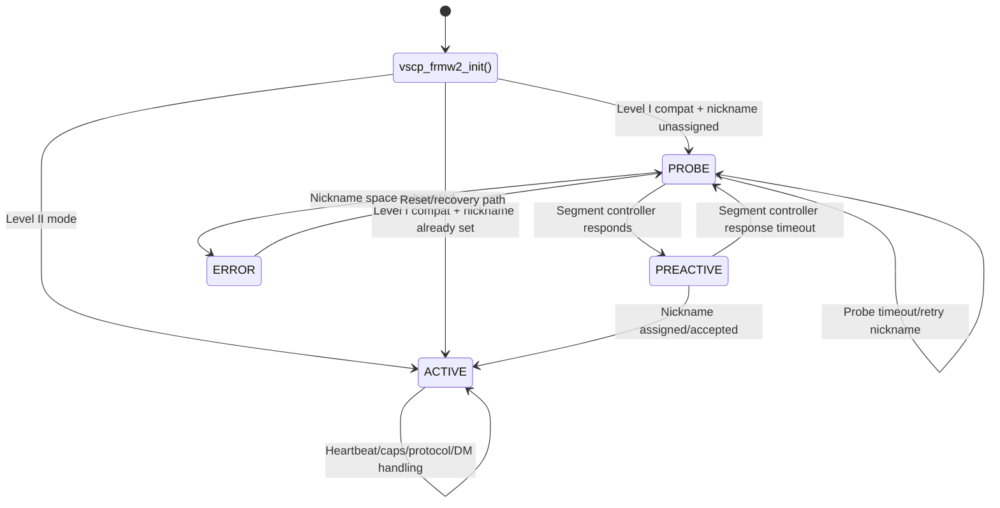
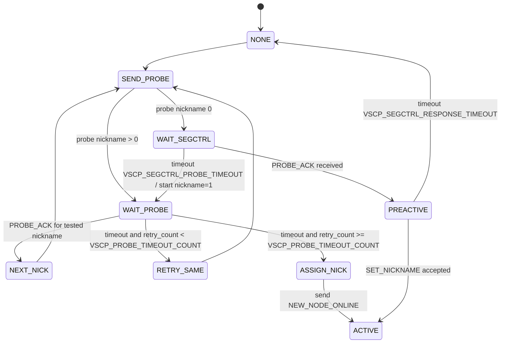

# vscp-firmware-level2

This document describes the VSCP Level II firmware framework implemented by:

- `common/vscp-firmware-level2.h`
- `common/vscp-firmware-level2.c`

The module provides protocol handling, register abstraction, node state management, and decision-matrix execution for VSCP Level II nodes (and Level I compatibility paths where configured).

---

## Purpose

`vscp_frmw2_work()` is the main periodic protocol worker.

At runtime, the framework:

1. Handles node startup and state transitions.
2. Performs nickname discovery/wait logic for Level I compatibility mode.
3. Processes incoming protocol events.
4. Maintains standard register behavior.
5. Runs decision-matrix filtering and actions.
6. Sends periodic heartbeat/capabilities events when configured.

---

## Include and Dependencies

```c
#include <vscp-firmware-level2.h>
```

Primary dependencies:

- `vscp.h`
- `vscp-class.h`
- `vscp-type.h`
- `vscp-firmware-helper.h`
- `vscp-projdefs.h`

---

## Version and Constants

Framework version constants:

- `FRMW2_MAJOR_VERSION`
- `FRMW2_MINOR_VERSION`

Selected timing and probe constants:

- `VSCP_PROBE_TIMEOUT`
- `VSCP_PROBE_TIMEOUT_COUNT`
- `VSCP_SEGCTRL_PROBE_TIMEOUT`
- `VSCP_SEGCTRL_RESPONSE_TIMEOUT`

State constants:

- `FRMW2_STATE_NONE`
- `FRMW2_STATE_PROBE`
- `FRMW2_STATE_PREACTIVE`
- `FRMW2_STATE_ACTIVE`
- `FRMW2_STATE_ERROR`

Substate constants:

- `FRMW2_SUBSTATE_NONE`
- `FRMW2_SUBSTATE_SEGCTRL_PROBE_WAITING`
- `FRMW2_SUBSTATE_PROBE_WAITING`

---

## Core Configuration Structure

`vscp_frmw2_firmware_config_t` is the central runtime and configuration container.

Major groups inside the structure:

- Runtime state and timers (`m_state`, `m_substate`, `m_timer1`)
- Node identity (`m_nickname`, `m_guid`, level selection)
- Probe/discovery behavior (`m_probe_*`)
- Optional behavior switches (`m_bEnableErrorReporting`, `m_bEnableLogging`, etc.)
- Event scheduling (`m_interval_heartbeat`, `m_interval_caps`)
- Decision matrix storage (`m_pDm`, `m_nDmRows`, `m_sizeDmRow`)
- Standard registers and persistent fields (`m_userId`, `m_manufacturerId`, `m_mdfurl`, etc.)

This structure is passed to `vscp_frmw2_init()` and then used internally by the framework.

---

## Public Framework API

### Initialization and Main Work

- `vscp_frmw2_init`
- `vscp_frmw2_init_persistent_storage`
- `vscp_frmw2_work`
- `vscp_frmw2_setup_event_ex`

### Nickname and Protocol Handling

- `vscp_frmw2_send_probe`
- `vscp_frmw2_nickname_discovery`
- `vscp_frmw2_nickname_wait`
- `vscp_frmw2_handle_protocol_event`

### Register and Page Operations

- `vscp_frmw2_read_reg`
- `vscp_frmw2_write_reg`
- `vscp_frmw2_page_read`
- `vscp_frmw2_page_write`
- `vscp_frmw2_vscp2_register_read`
- `vscp_frmw2_vscp2_register_write`
- `vscp_frmw2_extended_page_read`
- `vscp_frmw2_extended_page_write`

### Periodic and Discovery Events

- `vscp_frmw2_send_heartbeat`
- `vscp_frmw2_send_caps`
- `vscp_frmw2_send_high_end_server_probe`
- `vscp_frmw2_whois_response`

### Decision Matrix

- `vscp_frmw2_feed_level1_dm`
- `vscp_frmw2_feed_leve2_dm`
- `vscp_frmw2_feed_dm`
- `vscp_frmw2_report_dmatrix`

### Diagnostics and Logging

- `vscp_frmw2_send_error_event`
- `vscp_frmw2_send_log_event`

---

## Callback Contract (Implemented by Application/Port)

The framework depends on callbacks you provide.

Time and lifecycle callbacks:

- `vscp_frmw2_callback_get_milliseconds`
- `vscp_frmw2_callback_get_timestamp`
- `vscp_frmw2_callback_enter_bootloader`
- `vscp_frmw2_callback_restore_defaults`
- `vscp_frmw2_callback_reset`
- `vscp_frmw2_callback_feed_watchdog`

Transport and event callbacks:

- `vscp_frmw2_callback_send_event_ex`
- `vscp_frmw2_callback_set_event_time`
- `vscp_frmw2_callback_report_events_of_interest`
- `vscp_frmw2_callback_segment_ctrl_heartbeat`

Decision matrix callback:

- `vscp_frmw2_callback_dm_action`

Register and network callbacks:

- `vscp_frmw2_callback_read_reg`
- `vscp_frmw2_callback_write_reg`
- `vscp_frmw2_callback_stdreg_change`
- `vscp_frmw2_callback_get_ip_addr`

---

## Runtime State Machine Overview

Typical flow:

1. `vscp_frmw2_init()` sets defaults and initial state.
2. Node enters active state immediately in Level II mode.
3. In Level I compatibility mode, framework may run probe/nickname phases first.
4. `vscp_frmw2_work(pex)` is called periodically:
   - with `pex != NULL` when an event is available
   - with `pex == NULL` for periodic/state processing
5. Framework updates heartbeats/caps/protocol responses and applies decision matrix actions.

## Level II Startup/Runtime Diagram



## Nickname Discovery Timing Diagram



---

## Register Model Notes

The framework supports standard register handling and app-defined register callbacks.

Key points:

- `vscp_frmw2_read_reg()` / `vscp_frmw2_write_reg()` operate across standard and user register spaces.
- Page-based operations are provided for protocol page reads/writes.
- Extended page read/write supports larger access patterns.
- `vscp_frmw2_callback_stdreg_change()` is used to persist changes to standard register-backed data.

---

## Decision Matrix Notes

Decision matrix support is configurable through fields in `vscp_frmw2_firmware_config_t`:

- `m_pDm`
- `m_nDmRows`
- `m_sizeDmRow`
- `m_regOffsetDm`
- `m_pageDm`

Framework helpers feed events into Level I/Level II DM paths and invoke `vscp_frmw2_callback_dm_action()` when rules match.

---

## Minimal Integration Pattern

```c
vscp_frmw2_firmware_config_t cfg;
memset(&cfg, 0, sizeof(cfg));

cfg.m_level = VSCP_LEVEL2;
cfg.m_puserdata = &app_context;

int rv = vscp_frmw2_init(&cfg);
if (VSCP_ERROR_SUCCESS == rv) {
  for (;;) {
    // If no incoming event:
    vscp_frmw2_work(NULL);

    // If an incoming event is available:
    // vscpEventEx ex; fill from transport...
    // vscp_frmw2_work(&ex);
  }
}
```

---

## Common Integration Pitfalls

- Not calling `vscp_frmw2_work()` frequently enough for timers/probe/heartbeat handling.
- Missing callback implementations (especially send-event, register read/write, and time callbacks).
- Inconsistent register persistence handling after standard-register changes.
- Misconfigured decision matrix row size or storage pointer.
- Mixing Level I/Level II assumptions without setting `m_level` and transport behavior accordingly.

---

## Related Files

- `common/vscp-firmware-level2.h`
- `common/vscp-firmware-level2.c`
- `common/vscp-firmware-helper.h`
- `common/vscp-firmware.h`
- `docs/README.md`
