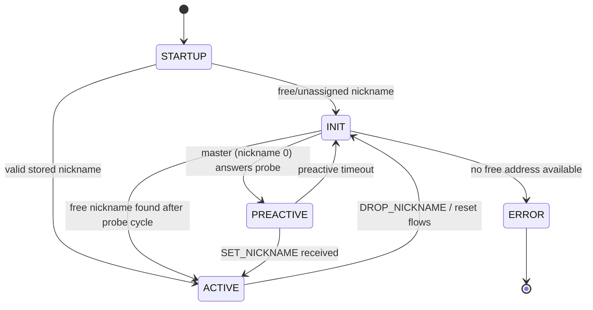

# vscp-firmware

This document describes the Level I firmware core implemented in `common/vscp-firmware.h` and `common/vscp-firmware.c`.

The module targets resource-constrained nodes and provides:

- Node startup and nickname discovery state machine.
- CLASS1.PROTOCOL handling for register and control operations.
- Register read/write dispatch between standard VSCP registers and application registers.
- Event send/receive wrappers around platform transport callbacks.
- Optional error/log event helpers.

## What this module owns

- Global Level I runtime state (`vscp_nickname`, `vscp_node_state`, timers, input/output event buffers).
- Protocol logic for standard Level I operations.
- Common register behavior in the standard register area (`0x80..0xFF`).

## What your platform/application must provide

The module is callback-driven and expects your target port to implement storage, transport, register page access, and board-specific control routines declared in the header.

Key callback groups:

- Transport:
  - `getVSCPFrame(...)`
  - `sendVSCPFrame(...)`
- Persistent identity/config:
  - `vscp_readNicknamePermanent`, `vscp_writeNicknamePermanent`
  - `vscp_getGUID`, `vscp_setGUID`
  - `vscp_getUserID`, `vscp_setUserID`
  - `vscp_getManufacturerId`, `vscp_setManufacturerId`
  - `vscp_getControlByte`, `vscp_setControlByte`, `vscp_init_pstorage`
- Register/page/application data:
  - `vscp_readAppReg`, `vscp_writeAppReg`
  - `vscp_getPageSelect`, `vscp_setPageSelect`
- Metadata and device info:
  - `vscp_getMajorVersion`, `vscp_getMinorVersion`, `vscp_getSubMinorVersion`
  - `vscp_getBootLoaderAlgorithm`, `vscp_getBufferSize`, `vscp_getRegisterPagesUsed`
  - `vscp_getMDF_URL`, `vscp_getFamilyCode`, `vscp_getFamilyType`, `vscp_getFirmwareCode`
  - `vscp_getZone`, `vscp_getSubzone`
- Control operations:
  - `vscp_getMatrixInfo`, `vscp_goBootloaderMode`, `vscp_restoreDefaults`
  - Optional: `vscp_getEmbeddedMdfInfo` (when `EMBEDDED_MDF` is enabled)
  - Optional (`DROP_NICKNAME_EXTENDED_FEATURES`): `vscp_hardreset`, `vscp_wait_ms`, `vscp_wait_s`

## Core public API

- `vscp_init()`
  - Initializes stack state, loads nickname, sets startup state/substate, resets buffers/timers.
- `vscp_check_pstorage()`
  - Verifies init marker bytes and initializes persistent storage if needed.
- `vscp_getEvent()`
  - Pulls one event from transport into `vscp_imsg` if input buffer is empty.
- `vscp_handleProtocolEvent()`
  - Processes incoming CLASS1.PROTOCOL events currently in `vscp_imsg`.
- `vscp_sendEvent()`
  - Sends `vscp_omsg` through `sendVSCPFrame`.
- `vscp_doOneSecondWork()`
  - One-second periodic maintenance: timekeeping, heartbeat, GUID-reset window handling.

State-machine helpers:

- `vscp_handleProbeState()`
- `vscp_handlePreActiveState()`
- `vscp_goActiveState()`
- `vscp_error()`

## Node state flow



## Recommended integration loop

The stack does not run its own scheduler. A typical superloop integration is:

```c
vscp_init();
vscp_check_pstorage();

for (;;) {
  vscp_getEvent();

  switch (vscp_node_state) {
    case VSCP_STATE_INIT:
      vscp_handleProbeState();
      break;

    case VSCP_STATE_PREACTIVE:
      vscp_handlePreActiveState();
      break;

    case VSCP_STATE_ACTIVE:
      if (vscp_imsg.flags & VSCP_VALID_MSG) {
        vscp_handleProtocolEvent();
        vscp_imsg.flags = 0;
      }
      break;

    case VSCP_STATE_ERROR:
      vscp_error();
      break;

    default:
      break;
  }

  // call vscp_doOneSecondWork() from a 1 Hz timer context
}
```

## Register behavior summary

Standard vs application dispatch:

- `vscp_readRegister(reg)`
  - `reg >= 0x80` → `vscp_readStdReg`
  - `reg < 0x80` → `vscp_readAppReg`
- `vscp_writeRegister(reg, value)`
  - `reg >= 0x80` → `vscp_writeStdReg`
  - `reg < 0x80` → `vscp_writeAppReg`

Notable standard-register behaviors:

- Alarm status register read clears alarm bits after returning value.
- Node error counter write resets the counter.
- Page select MSB/LSB map to `vscp_page_select`.
- Protected writes (GUID/manufacturer IDs) require `ENABLE_WRITE_2PROTECTED_LOCATIONS` and page select `0xFFFF`.
- Default restore sequence expects `0x55` then `0xAA` to register `0xA2` within one second.

## CLASS1.PROTOCOL handlers included

`vscp_handleProtocolEvent()` includes handling for common protocol operations, including:

- Heartbeat/new node/nickname management.
- Read/write/increment/decrement register operations.
- Page read/write and extended page read/write.
- Who-is-there response generation.
- Matrix info and optional embedded MDF response.
- Bootloader entry and guided reset behavior.

## Timing expectations

- `vscp_timer` should increment every 1 ms externally.
- `vscp_initbtncnt`, `vscp_statuscnt`, `vscp_configtimer` are expected to be maintained by platform timing logic.
- `vscp_doOneSecondWork()` should be called once per second.

## Optional compile-time features

- `VSCP_FIRMWARE_ENABLE_ERROR_REPORTING`
  - Enables `vscp_sendErrorEvent(...)`.
- `VSCP_FIRMWARE_ENABLE_LOGGING`
  - Enables `vscp_sendLogEvent(...)`.
- `EMBEDDED_MDF`
  - Enables embedded MDF protocol support path.
- `ENABLE_WRITE_2PROTECTED_LOCATIONS`
  - Allows writes to protected GUID/manufacturer locations under guarded conditions.
- `DROP_NICKNAME_EXTENDED_FEATURES`
  - Enables extended drop-nickname behavior hooks.

## Bring-up checklist

- [ ] Implement all mandatory transport and storage callbacks.
- [ ] Verify persistent initialization bytes (`0x55`, `0xAA`) behavior.
- [ ] Confirm nickname discovery reaches `VSCP_STATE_ACTIVE` on your bus.
- [ ] Confirm `READ_REGISTER` / `WRITE_REGISTER` for both app and standard ranges.
- [ ] Verify 1 Hz `vscp_doOneSecondWork()` call and heartbeat emission.

For a reusable, port-focused checklist, see [examples/vscp-firmware-porting-checklist.md](examples/vscp-firmware-porting-checklist.md).
