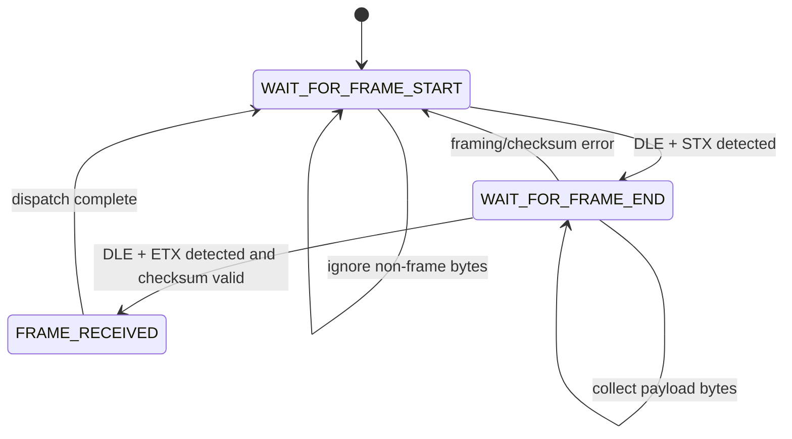
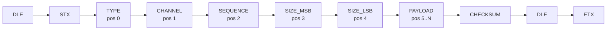

# vscp-serial

This document describes the VSCP serial protocol definitions provided by:

- `common/vscp-serial.h`

In this workspace snapshot, `vscp-serial` is a definition/header module (protocol constants, frame types, and capabilities struct). No matching `common/vscp-serial.c` implementation file is present here.

---

## Purpose

`vscp-serial.h` defines the wire-level constants for VSCP over serial channels (for example RS-232 style transport framing).

It provides:

- framing control bytes
- parser state constants
- frame layout index constants
- frame type IDs
- driver error codes
- command code base
- capability structure layout

---

## Include

```c
#include <vscp-serial.h>
```

The header includes `vscp.h` and is intended for driver/parser implementations.

---

## Framing Control Bytes

- `DLE` (`0x10`)
- `STX` (`0x02`)
- `ETX` (`0x03`)

These bytes are used for frame delimiting/escaping in serial protocol handling.

---

## Parser States

- `STATE_VSCP_SERIAL_DRIVER_WAIT_FOR_FRAME_START`
- `STATE_VSCP_SERIAL_DRIVER_WAIT_FOR_FRAME_END`
- `STATE_VSCP_SERIAL_DRIVER_FRAME_RECEIVED`

Use these state IDs in byte-stream receiver state machines.

## Parser State Diagram



---

## Frame Layout Positions

Frame field index constants:

- `VSCP_SERIAL_DRIVER_POS_FRAME_TYPE`
- `VSCP_SERIAL_DRIVER_POS_FRAME_CHANNEL`
- `VSCP_SERIAL_DRIVER_POS_FRAME_SEQUENCY`
- `VSCP_SERIAL_DRIVER_POS_FRAME_SIZE_PAYLOAD_MSB`
- `VSCP_SERIAL_DRIVER_POS_FRAME_SIZE_PAYLOAD_LSB`
- `VSCP_SERIAL_DRIVER_POS_FRAME_PAYLOAD`

These offsets define where each field is expected in a decoded frame buffer.

## Frame Layout Diagram



---

## Frame Types

Common frame types:

- `VSCP_SERIAL_DRIVER_FRAME_TYPE_NOOP`
- `VSCP_SERIAL_DRIVER_FRAME_TYPE_VSCP_EVENT`
- `VSCP_SERIAL_DRIVER_FRAME_TYPE_CANAL`
- `VSCP_SERIAL_DRIVER_FRAME_TYPE_CONFIGURE`
- `VSCP_SERIAL_DRIVER_FRAME_TYPE_POLL`
- `VSCP_SERIAL_DRIVER_FRAME_TYPE_NO_EVENT`

Multiframe and capability frames:

- `VSCP_SERIAL_DRIVER_FRAME_TYPE_MULTI_FRAME_CANAL`
- `VSCP_SERIAL_DRIVER_FRAME_TYPE_MULTI_FRAME_VSCP`
- `VSCP_SERIAL_DRIVER_FRAME_TYPE_CAPS_REQUEST`
- `VSCP_SERIAL_DRIVER_FRAME_TYPE_CAPS_RESPONSE`

Timestamped variants:

- `VSCP_SERIAL_DRIVER_FRAME_TYPE_VSCP_EVENT_TIMESTAMP`
- `VSCP_SERIAL_DRIVER_FRAME_TYPE_CANAL_TIMESTAMP`
- `VSCP_SERIAL_DRIVER_FRAME_TYPE_MULTI_FRAME_CANAL_TIMESTAMP`
- `VSCP_SERIAL_DRIVER_FRAME_TYPE_MULTI_FRAME_VSCP_TIMESTAMP`

ACK/NACK and command channels:

- `VSCP_SERIAL_DRIVER_FRAME_TYPE_SENT_ACK`
- `VSCP_SERIAL_DRIVER_FRAME_TYPE_SENT_NACK`
- `VSCP_SERIAL_DRIVER_FRAME_TYPE_ACK`
- `VSCP_SERIAL_DRIVER_FRAME_TYPE_NACK`
- `VSCP_SERIAL_DRIVER_FRAME_TYPE_ERROR`
- `VSCP_SERIAL_DRIVER_FRAME_TYPE_COMMAND_REPLY`
- `VSCP_SERIAL_DRIVER_FRAME_TYPE_COMMAND`

---

## Errors and Commands

Error constants:

- `VSCP_SERIAL_DRIVER_ERROR_CHECKSUM`
- `VSCP_SERIAL_DRIVER_ERROR_UNKNOWN_OPERATION`

Command base:

- `VSCP_SERIAL_DRIVER_COMMAND_NOOP`

---

## Capability Structure

Capabilities are represented by:

- `vscp_serial_caps`

Fields:

- `maxVscpFrames`
- `maxCanalFrames`

Packed size constant:

- `VSCP_SERIAL_DRIVER_CAPS_SIZE`

---

## Minimal Parser Skeleton (Example)

```c
uint8_t state = STATE_VSCP_SERIAL_DRIVER_WAIT_FOR_FRAME_START;

for (;;) {
  uint8_t ch = read_serial_byte();

  switch (state) {
    case STATE_VSCP_SERIAL_DRIVER_WAIT_FOR_FRAME_START:
      if (ch == DLE) {
        // expect STX next
      }
      break;

    case STATE_VSCP_SERIAL_DRIVER_WAIT_FOR_FRAME_END:
      // collect bytes, track DLE/ETX, validate payload size/checksum
      break;

    case STATE_VSCP_SERIAL_DRIVER_FRAME_RECEIVED:
      // parse by VSCP_SERIAL_DRIVER_POS_* and FRAME_TYPE_*
      state = STATE_VSCP_SERIAL_DRIVER_WAIT_FOR_FRAME_START;
      break;
  }
}
```

---

## Integration Notes

- Keep parser state machine strict about frame delimiters and escape handling.
- Validate payload-size fields before buffer access.
- Validate checksum before dispatching frame type.
- Handle ACK/NACK and command/reply channels separately from event channels.
- Keep this header synchronized with upstream if copied from another VSCP source tree.

---

## Related Files

- `common/vscp-serial.h`
- `common/vscp.h`
- `docs/README.md`
